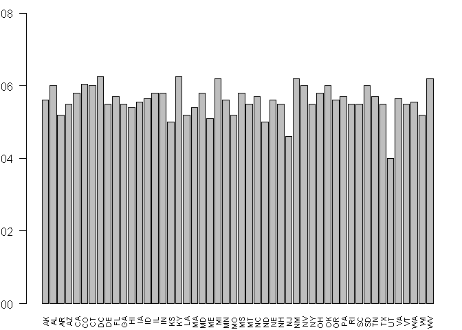
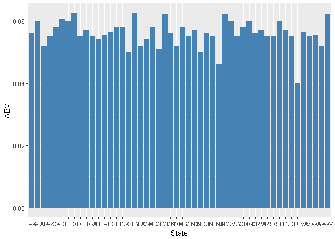
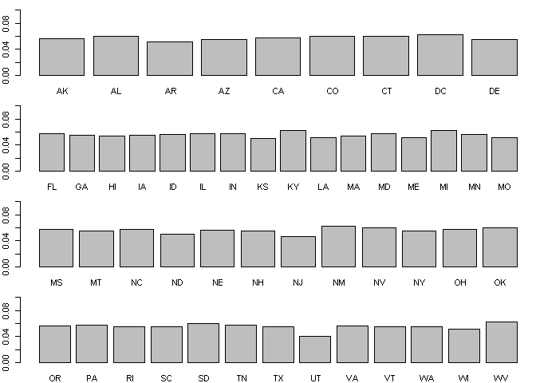

# Craft-Cans Case Study
Arturo Casillas & Kevin Dickens  
October 6, 2017  


# R Markdown Dummy

First

# About the Data
## Source

- The tables contain a list of 2410 US craft beers and 510 US breweries. 
- The beer data corresponds to beers available in cans
- This data was traced to CraftCans.com. 

## View the data


```
## Warning: package 'xtable' was built under R version 3.4.2
```

```
## 
## Please cite as:
```

```
##  Hlavac, Marek (2015). stargazer: Well-Formatted Regression and Summary Statistics Tables.
```

```
##  R package version 5.2. http://CRAN.R-project.org/package=stargazer
```

```
## Warning: package 'ggplot2' was built under R version 3.4.2
```


```r
str(BeersData)
```

```
## 'data.frame':	2410 obs. of  7 variables:
##  $ Name      : Factor w/ 2305 levels "#001 Golden Amber Lager",..: 1638 577 1705 1842 1819 268 1160 758 1093 486 ...
##  $ Beer_ID   : int  1436 2265 2264 2263 2262 2261 2260 2259 2258 2131 ...
##  $ ABV       : num  0.05 0.066 0.071 0.09 0.075 0.077 0.045 0.065 0.055 0.086 ...
##  $ IBU       : int  NA NA NA NA NA NA NA NA NA NA ...
##  $ Brewery_id: int  409 178 178 178 178 178 178 178 178 178 ...
##  $ Style     : Factor w/ 100 levels "","Abbey Single Ale",..: 19 18 16 12 16 80 18 22 18 12 ...
##  $ Ounces    : num  12 12 12 12 12 12 12 12 12 12 ...
```

```r
str(BreweriesData)
```

```
## 'data.frame':	558 obs. of  4 variables:
##  $ Brew_ID: int  1 2 3 4 5 6 7 8 9 10 ...
##  $ Name   : Factor w/ 551 levels "10 Barrel Brewing Company",..: 355 12 266 319 201 136 227 477 59 491 ...
##  $ City   : Factor w/ 384 levels "Abingdon","Abita Springs",..: 228 200 122 299 300 62 91 48 152 136 ...
##  $ State  : Factor w/ 51 levels " AK"," AL"," AR",..: 24 18 20 5 5 41 6 23 23 23 ...
```

### Munging
#### Basic alterations
- Column names are altered for clarity and to minimize merging issues
- The beers and breweries are linked by a numeric ID, which is used to merge the two tables
  - 'Brew_ID'


```r
## Prepare for merging ##
names(BeersData)
```

```
## [1] "Name"       "Beer_ID"    "ABV"        "IBU"        "Brewery_id"
## [6] "Style"      "Ounces"
```

```r
names(BeersData)[5] = "Brew_ID"
names(BeersData)[1] = "Beer.name"
names(BreweriesData)[2] = "Brewery.name"


## Merge Data ##
AllBeer <- merge(BeersData, BreweriesData, by="Brew_ID")
str(AllBeer)
```

```
## 'data.frame':	2410 obs. of  10 variables:
##  $ Brew_ID     : int  1 1 1 1 1 1 2 2 2 2 ...
##  $ Beer.name   : Factor w/ 2305 levels "#001 Golden Amber Lager",..: 802 1258 2185 1640 1926 1525 458 1218 43 71 ...
##  $ Beer_ID     : int  2692 2691 2690 2689 2688 2687 2686 2685 2684 2683 ...
##  $ ABV         : num  0.045 0.049 0.048 0.06 0.06 0.056 0.08 0.125 0.077 0.042 ...
##  $ IBU         : int  50 26 19 38 25 47 68 80 25 42 ...
##  $ Style       : Factor w/ 100 levels "","Abbey Single Ale",..: 16 77 48 83 22 57 12 46 77 18 ...
##  $ Ounces      : num  16 16 16 16 16 16 16 16 16 16 ...
##  $ Brewery.name: Factor w/ 551 levels "10 Barrel Brewing Company",..: 355 355 355 355 355 355 12 12 12 12 ...
##  $ City        : Factor w/ 384 levels "Abingdon","Abita Springs",..: 228 228 228 228 228 228 200 200 200 200 ...
##  $ State       : Factor w/ 51 levels " AK"," AL"," AR",..: 24 24 24 24 24 24 18 18 18 18 ...
```

#### View the final data

-first 6 rows

```r
kable(head(AllBeer, 6), row.names = FALSE)
```


 Brew_ID  Beer.name        Beer_ID     ABV   IBU  Style                                  Ounces  Brewery.name        City          State 
--------  --------------  --------  ------  ----  ------------------------------------  -------  ------------------  ------------  ------
       1  Get Together        2692   0.045    50  American IPA                               16  NorthGate Brewing   Minneapolis   MN    
       1  Maggie's Leap       2691   0.049    26  Milk / Sweet Stout                         16  NorthGate Brewing   Minneapolis   MN    
       1  Wall's End          2690   0.048    19  English Brown Ale                          16  NorthGate Brewing   Minneapolis   MN    
       1  Pumpion             2689   0.060    38  Pumpkin Ale                                16  NorthGate Brewing   Minneapolis   MN    
       1  Stronghold          2688   0.060    25  American Porter                            16  NorthGate Brewing   Minneapolis   MN    
       1  Parapet ESB         2687   0.056    47  Extra Special / Strong Bitter (ESB)        16  NorthGate Brewing   Minneapolis   MN    


```r
#print(xtable(head(AllBeer)), comment=F, type='html', html.table.attributes = "border=0")
head(AllBeer, 6)
```

```
##   Brew_ID     Beer.name Beer_ID   ABV IBU
## 1       1  Get Together    2692 0.045  50
## 2       1 Maggie's Leap    2691 0.049  26
## 3       1    Wall's End    2690 0.048  19
## 4       1       Pumpion    2689 0.060  38
## 5       1    Stronghold    2688 0.060  25
## 6       1   Parapet ESB    2687 0.056  47
##                                 Style Ounces       Brewery.name
## 1                        American IPA     16 NorthGate Brewing 
## 2                  Milk / Sweet Stout     16 NorthGate Brewing 
## 3                   English Brown Ale     16 NorthGate Brewing 
## 4                         Pumpkin Ale     16 NorthGate Brewing 
## 5                     American Porter     16 NorthGate Brewing 
## 6 Extra Special / Strong Bitter (ESB)     16 NorthGate Brewing 
##          City State
## 1 Minneapolis    MN
## 2 Minneapolis    MN
## 3 Minneapolis    MN
## 4 Minneapolis    MN
## 5 Minneapolis    MN
## 6 Minneapolis    MN
```


-last 6 rows


```r
library(knitr)
kable(tail(AllBeer, 6))
```

        Brew_ID  Beer.name                    Beer_ID     ABV   IBU  Style                      Ounces  Brewery.name                    City            State 
-----  --------  --------------------------  --------  ------  ----  ------------------------  -------  ------------------------------  --------------  ------
2405        556  Pilsner Ukiah                     98   0.055    NA  German Pilsener                12  Ukiah Brewing Company           Ukiah           CA    
2406        557  Heinnieweisse Weissebier          52   0.049    NA  Hefeweizen                     12  Butternuts Beer and Ale         Garrattsville   NY    
2407        557  Snapperhead IPA                   51   0.068    NA  American IPA                   12  Butternuts Beer and Ale         Garrattsville   NY    
2408        557  Moo Thunder Stout                 50   0.049    NA  Milk / Sweet Stout             12  Butternuts Beer and Ale         Garrattsville   NY    
2409        557  Porkslap Pale Ale                 49   0.043    NA  American Pale Ale (APA)        12  Butternuts Beer and Ale         Garrattsville   NY    
2410        558  Urban Wilderness Pale Ale         30   0.049    NA  English Pale Ale               12  Sleeping Lady Brewing Company   Anchorage       AK    


## Data Integrity
### Missing Vlaues
#### Look for missing or nonsense values
- Check the missing values number and indicators

```r
## Check for missing values ##
apply(apply(AllBeer, 2, is.na), 2, sum)
```

```
##      Brew_ID    Beer.name      Beer_ID          ABV          IBU 
##            0            0            0           62         1005 
##        Style       Ounces Brewery.name         City        State 
##            0            0            0            0            0
```

#### Notes and Observations
- Only ABV and IBU have missing values
  - Almost 50% of IBU values are missing
  -This certainly affect any analysis that hinges on IBU values
- Spot checks on the data suggest that character variables use blanks for missing values
  - This needs to be verified

#### Double Check Missing Vlaues
- Check for blanks instead of NA's

```r
## Double Check ##
## Look at balnk Strings ##
apply(AllBeer, 2, function(y) sum(y == ""))
```

```
##      Brew_ID    Beer.name      Beer_ID          ABV          IBU 
##            0            0            0           NA           NA 
##        Style       Ounces Brewery.name         City        State 
##            5            0            0            0            0
```

```r
##Fancy table
library(pander)
#panderOptions('graph.fontsize', .8)
pander(apply(AllBeer, 2, function(y) sum(y == "")))
```


---------------------------------------------------------------------------
 Brew_ID   Beer.name   Beer_ID   ABV   IBU   Style   Ounces   Brewery.name 
--------- ----------- --------- ----- ----- ------- -------- --------------
    0          0          0      NA    NA      5       0           0       
---------------------------------------------------------------------------

Table: Table continues below

 
--------------
 City   State 
------ -------
  0       0   
--------------
- 'Stye', which represents style of beer, has 5 additional missing values

#### Notes and Observations
- There are:
  - 1005 missing entries for IBU
  - 67 missing entries for ABV
  - 5 missing entries for Style

## External Data

#### Region and Division Data
- From R
  - R contains additional region and division data per state in the package 'Datasets'
  - This data is from a 1977 report from the chamber of commerce

  

```
## 'data.frame':	2395 obs. of  12 variables:
##  $ State         : Factor w/ 51 levels " AK"," AL"," AR",..: 1 1 1 1 1 1 1 1 1 1 ...
##  $ Brew_ID       : int  103 103 494 459 103 459 224 271 224 224 ...
##  $ Beer.name     : Factor w/ 2305 levels "#001 Golden Amber Lager",..: 1137 114 1604 1955 1138 1847 1878 94 1873 1584 ...
##  $ Beer_ID       : int  1667 2436 920 349 1706 348 434 1920 587 1814 ...
##  $ ABV           : num  0.06 0.051 0.052 0.068 0.055 0.058 0.057 0.053 0.048 0.063 ...
##  $ IBU           : int  70 NA 17 NA NA NA 70 18 12 61 ...
##  $ Style         : Factor w/ 100 levels "","Abbey Single Ale",..: 16 5 18 16 41 93 16 3 100 16 ...
##  $ Ounces        : num  12 12 12 12 12 12 12 12 12 12 ...
##  $ Brewery.name  : Factor w/ 551 levels "10 Barrel Brewing Company",..: 279 279 98 276 279 276 318 16 318 318 ...
##  $ City          : Factor w/ 384 levels "Abingdon","Abita Springs",..: 8 8 8 317 8 317 8 165 8 8 ...
##  $ state.region  : Factor w/ 4 levels "Northeast","South",..: 4 4 4 4 4 4 4 4 4 4 ...
##  $ state.division: Factor w/ 9 levels "New England",..: 9 9 9 9 9 9 9 9 9 9 ...
```


#Analysis

- The primary variables of interest are ABV, IBU, Style, State, Region and Division

## State Summary

- The total number of breweries per state


```r
library(pander)
panderOptions('table.split.table', 100)
panderOptions('table.continues', '')
StBrews=sapply(tapply(AllBeerReg$Brew_ID, AllBeerReg$State, unique), length)
pander(StBrews)
```


---------------------------------------------------------------------------------------------------
 AK   AL   AR   AZ   CA   CO   CT   DC   DE   FL   GA   HI   IA   ID   IL   IN   KS   KY   LA   MA 
---- ---- ---- ---- ---- ---- ---- ---- ---- ---- ---- ---- ---- ---- ---- ---- ---- ---- ---- ----
 7    3    2    11   39   47   8    1    2    15   7    4    5    5    18   22   3    4    5    23 
---------------------------------------------------------------------------------------------------

 
---------------------------------------------------------------------------------------------------
 MD   ME   MI   MN   MO   MS   MT   NC   ND   NE   NH   NJ   NM   NV   NY   OH   OK   OR   PA   RI 
---- ---- ---- ---- ---- ---- ---- ---- ---- ---- ---- ---- ---- ---- ---- ---- ---- ---- ---- ----
 7    9    32   12   9    2    9    19   1    5    3    3    4    2    16   15   6    29   25   5  
---------------------------------------------------------------------------------------------------

 
------------------------------------------------------
 SC   SD   TN   TX   UT   VA   VT   WA   WI   WV   WY 
---- ---- ---- ---- ---- ---- ---- ---- ---- ---- ----
 4    1    3    28   4    16   10   23   20   1    0  
------------------------------------------------------

- The differnet number of styles brewed per state


```r
library(pander)
#panderOptions('graph.fontsize', .8)
StStyle=sapply(tapply(AllBeerReg$Style, AllBeerReg$State, unique), length)
pander(StStyle)
```


---------------------------------------------------------------------------------------------------
 AK   AL   AR   AZ   CA   CO   CT   DC   DE   FL   GA   HI   IA   ID   IL   IN   KS   KY   LA   MA 
---- ---- ---- ---- ---- ---- ---- ---- ---- ---- ---- ---- ---- ---- ---- ---- ---- ---- ---- ----
 14   8    5    19   46   61   15   8    2    19   9    15   17   19   34   47   15   17   12   33 
---------------------------------------------------------------------------------------------------

 
---------------------------------------------------------------------------------------------------
 MD   ME   MI   MN   MO   MS   MT   NC   ND   NE   NH   NJ   NM   NV   NY   OH   OK   OR   PA   RI 
---- ---- ---- ---- ---- ---- ---- ---- ---- ---- ---- ---- ---- ---- ---- ---- ---- ---- ---- ----
 16   17   46   25   21   8    18   25   3    17   5    6    10   10   35   24   12   29   42   17 
---------------------------------------------------------------------------------------------------

 
------------------------------------------------------
 SC   SD   TN   TX   UT   VA   VT   WA   WI   WV   WY 
---- ---- ---- ---- ---- ---- ---- ---- ---- ---- ----
 11   7    5    46   17   21   16   23   30   2    0  
------------------------------------------------------

- The total number of breweries per region
- Prior to June 1984, the Midwest Region was designated as the North Central Region


```r
library(pander)
#panderOptions('graph.fontsize', .8)
StBrews=sapply(tapply(AllBeerReg$Brew_ID, AllBeerReg$state.region, unique), length)
pander(StBrews)
```


------------------------------------------
 Northeast   South   North Central   West 
----------- ------- --------------- ------
    100       119         165        170  
------------------------------------------

- The differnet number of styles brewed per state


```r
library(pander)
#panderOptions('graph.fontsize', .8)
StBrews=sapply(tapply(AllBeerReg$Brew_ID, AllBeerReg$state.division, unique), length)
pander(StBrews)
```


------------------------------------------------------------------------------------------
 New England   Middle Atlantic   South Atlantic   East South Central   West South Central 
------------- ----------------- ---------------- -------------------- --------------------
     66              34                79                 16                   24         
------------------------------------------------------------------------------------------

 
--------------------------------------------------------------
 East North Central   West North Central   Mountain   Pacific 
-------------------- -------------------- ---------- ---------
         71                   94             101        69    
--------------------------------------------------------------


##Beer Styles

- The different number of styles brewed per region


```r
library(pander)
#panderOptions('graph.fontsize', .8)
StStyle=sapply(tapply(AllBeerReg$Style, AllBeerReg$state.region, unique), length)
pander(StStyle)
```


------------------------------------------
 Northeast   South   North Central   West 
----------- ------- --------------- ------
    62        65          83          85  
------------------------------------------

- The differnet number of styles brewed per division


```r
library(pander)
#panderOptions('graph.fontsize', .8)
StStyle=sapply(tapply(AllBeerReg$Style, AllBeerReg$state.division, unique), length)
pander(StStyle)
```


------------------------------------------------------------------------------------------
 New England   Middle Atlantic   South Atlantic   East South Central   West South Central 
------------- ----------------- ---------------- -------------------- --------------------
     55              35                57                 32                   33         
------------------------------------------------------------------------------------------

 
--------------------------------------------------------------
 East North Central   West North Central   Mountain   Pacific 
-------------------- -------------------- ---------- ---------
         60                   70              77        58    
--------------------------------------------------------------

- 10 most popular beer styles 


```
##  Factor w/ 100 levels "","Abbey Single Ale",..: 16 5 18 16 41 93 16 3 100 16 ...
```

```
## 
##                   American IPA        American Pale Ale (APA) 
##                            422                            242 
##       American Amber / Red Ale            American Blonde Ale 
##                            131                            107 
## American Double / Imperial IPA        American Pale Wheat Ale 
##                            105                             96 
##             American Brown Ale                American Porter 
##                             69                             68 
##         Saison / Farmhouse Ale                        Witbier 
##                             52                             51 
##         Fruit / Vegetable Beer 
##                             49
```

- Boxplot of median ABV per state


```r
m=data.frame(aggregate(ABV~State, data=AllBeerReg, median))
par(las=2, mar=c(2,2,1,1))
barplot(m$ABV, names.arg = m$State, cex.names = 0.7, ylim=c(0.00, 0.08))
```

<!-- -->


```r
library(ggplot2)
p=data.frame(aggregate(ABV~State+state.region, data=AllBeerReg, median))
ggplot(p, aes(x=State, y=ABV)) +
  geom_bar(stat="identity", fill="steelblue") 
```

<!-- -->

```r
#+
#  facet_wrap(~state.region)

#ggplot2.barplot(data=m, xName="clarity", 
#              faceting=TRUE, facetingVarNames="State", facetingDirection="horizontal")

par(mfrow=c(4,1))
par(mar = c(2,2,1,0))
for(i in 1:4){
  sub=m[p$state.region==unique(p$state.region)[i],]
  barplot(sub$ABV, names.arg = sub$State, ylim=c(0,0.10))
}
```

<!-- -->

- Boxplot of median IBU per state


```r
n=data.frame(aggregate(IBU~State, data=AllBeerReg, median))
par(las=2, mar=c(2,2,1,1))
barplot(n$IBU, names.arg = n$State, cex.names = 0.7)
```

<!-- -->

##ABV Summary

- Summary of the ABV variable
- 50% of canned beers are between 5% and 6.7% alcohol per volume


```
##    Min. 1st Qu.  Median    Mean 3rd Qu.    Max.    NA's 
##  0.0010  0.0500  0.0560  0.0598  0.0670  0.1280      62
```

#### Beers with most alcohol

- 'Lee Hill Series Vol. 5 - Belgian Style Quadrupel Ale' out of Colorado is the most alcoholic beer
- Frout 
- Two out of the five most alcoholic beers come from 'Upslope Brewing Company'


```
##      State                                            Beer.name Beer_ID
## 534     CO Lee Hill Series Vol. 5 - Belgian Style Quadrupel Ale    2565
## 989     KY                                       London Balling    2685
## 885     IN                                                 Csar    2621
## 494     CO     Lee Hill Series Vol. 4 - Manhattan Style Rye Ale    2564
## 1655    NY                                               4Beans    2574
## 121     CA                                        Lower De Boom    1036
## 142     CA                                   Chaotic Double IPA    1674
## 146     CA                         Ex Umbris Rye Imperial Stout     904
## 235     CA                                         Double Trunk    1561
## 479     CO                                   GUBNA Imperial IPA       6
##        ABV IBU Ounces                            Style
## 534  0.128  NA   19.2                 Quadrupel (Quad)
## 989  0.125  80   16.0               English Barleywine
## 885  0.120  90   16.0           Russian Imperial Stout
## 494  0.104  NA   19.2                         Rye Beer
## 1655 0.100  52   12.0                    Baltic Porter
## 121  0.099  92    8.4              American Barleywine
## 142  0.099  93   12.0   American Double / Imperial IPA
## 146  0.099  85   16.0 American Double / Imperial Stout
## 235  0.099 101   16.0   American Double / Imperial IPA
## 479  0.099 100   12.0   American Double / Imperial IPA
##                    Brewery.name          City
## 534     Upslope Brewing Company       Boulder
## 989   Against the Grain Brewery    Louisville
## 885     Tin Man Brewing Company    Evansville
## 494     Upslope Brewing Company       Boulder
## 1655        Sixpoint Craft Ales      Brooklyn
## 121      21st Amendment Brewery San Francisco
## 142   Manzanita Brewing Company        Santee
## 146        Hess Brewing Company     San Diego
## 235  The Dudes' Brewing Company      Torrance
## 479         Oskar Blues Brewery      Longmont
```

##IBU Summary

- Summary of the IBU variable


```
##    Min. 1st Qu.  Median    Mean 3rd Qu.    Max.    NA's 
##     4.0    21.0    35.0    42.8    64.0   138.0    1002
```

#### Beers with highest IBU

- 'Bitter Bitch Imperial IPA' out of Oregon is the most bitter beer
- Nine out of the 10 most bitter beers are IPAs
- Eight our of the 10 most bitter beers are Imperial IPAs


```
##      State                       Beer.name Beer_ID   ABV IBU Ounces
## 1824    OR       Bitter Bitch Imperial IPA     980 0.082 138     12
## 2206    VA              Troopers Alley IPA    1676 0.059 135     12
## 1081    MA                   Dead-Eye DIPA    2067 0.090 130     16
## 1691    OH Bay of Bengal Double IPA (2014)    2440 0.089 126     12
## 1343    MN                    Abrasive Ale      15 0.097 120     16
## 2213    VT                    Heady Topper    1111 0.080 120     16
## 2218    VT                    Heady Topper     379 0.080 120     16
## 2033    TX                    More Cowbell    2123 0.090 118     16
## 200     CA                   Blazing World    1492 0.065 115     16
## 570     DC      On the Wings of Armageddon     851 0.092 115     12
##                               Style                       Brewery.name
## 1824 American Double / Imperial IPA            Astoria Brewing Company
## 2206                   American IPA         Wolf Hills Brewing Company
## 1081 American Double / Imperial IPA           Cape Ann Brewing Company
## 1691 American Double / Imperial IPA Christian Moerlein Brewing Company
## 1343 American Double / Imperial IPA              Surly Brewing Company
## 2213 American Double / Imperial IPA                      The Alchemist
## 2218 American Double / Imperial IPA                      The Alchemist
## 2033 American Double / Imperial IPA      Buffalo Bayou Brewing Company
## 200        American Amber / Red Ale                  Modern Times Beer
## 570  American Double / Imperial IPA            DC Brau Brewing Company
##                 City
## 1824         Astoria
## 2206        Abingdon
## 1081      Gloucester
## 1691      Cincinnati
## 1343 Brooklyn Center
## 2213       Waterbury
## 2218       Waterbury
## 2033         Houston
## 200        San Diego
## 570       Washington
```


## Fancier Plot

- ABV and IBU appear to be related
- The relationship is not very strong in the sense that a large increase of IBU values are associated with a small increase in ABV

<!-- -->

#Conclusion


#Appendix

### Alt Code
-First 6 again


```r
#print(xtable(head(AllBeer)), comment=F, type='html', html.table.attributes = "border=0")
#head(AllBeer, 6)
pandoc.table(head(AllBeer, 6), style="simple")
```


 Brew_ID     Beer.name     Beer_ID    ABV    IBU                  Style                  Ounces 
--------- --------------- --------- ------- ----- ------------------------------------- --------
    1      Get Together     2692     0.045   50               American IPA                 16   
    1      Maggie's Leap    2691     0.049   26            Milk / Sweet Stout              16   
    1       Wall's End      2690     0.048   19             English Brown Ale              16   
    1         Pumpion       2689     0.06    38                Pumpkin Ale                 16   
    1       Stronghold      2688     0.06    25              American Porter               16   
    1       Parapet ESB     2687     0.056   47    Extra Special / Strong Bitter (ESB)     16   

 

   Brewery.name         City       State 
------------------- ------------- -------
 NorthGate Brewing   Minneapolis    MN   
 NorthGate Brewing   Minneapolis    MN   
 NorthGate Brewing   Minneapolis    MN   
 NorthGate Brewing   Minneapolis    MN   
 NorthGate Brewing   Minneapolis    MN   
 NorthGate Brewing   Minneapolis    MN   

```r
#library(knitr)
#library(kableExtra)
kable(head(AllBeer, 6), row.names = FALSE)
```


 Brew_ID  Beer.name        Beer_ID     ABV   IBU  Style                                  Ounces  Brewery.name        City          State 
--------  --------------  --------  ------  ----  ------------------------------------  -------  ------------------  ------------  ------
       1  Get Together        2692   0.045    50  American IPA                               16  NorthGate Brewing   Minneapolis   MN    
       1  Maggie's Leap       2691   0.049    26  Milk / Sweet Stout                         16  NorthGate Brewing   Minneapolis   MN    
       1  Wall's End          2690   0.048    19  English Brown Ale                          16  NorthGate Brewing   Minneapolis   MN    
       1  Pumpion             2689   0.060    38  Pumpkin Ale                                16  NorthGate Brewing   Minneapolis   MN    
       1  Stronghold          2688   0.060    25  American Porter                            16  NorthGate Brewing   Minneapolis   MN    
       1  Parapet ESB         2687   0.056    47  Extra Special / Strong Bitter (ESB)        16  NorthGate Brewing   Minneapolis   MN    

```r
#%>%
#kable_styling(latex_options = c("striped", "scale_down"))
#print(xtable(head(AllBeer, 6)), comment = F, type='html')
```

#### Tail2

-experiment with plotting last 6 rows


State    Brew_ID  Beer.name                     Beer_ID     ABV   IBU  Style                       Ounces  Brewery.name                   City        state.region   state.division 
------  --------  ---------------------------  --------  ------  ----  -------------------------  -------  -----------------------------  ----------  -------------  ---------------
AK           103  King Street IPA                  1667   0.060    70  American IPA                    12  King Street Brewing Company    Anchorage   West           Pacific        
AK           103  Amber Ale                        2436   0.051    NA  American Amber / Red Ale        12  King Street Brewing Company    Anchorage   West           Pacific        
AK           494  Polar Pale Ale                    920   0.052    17  American Pale Ale (APA)         12  Broken Tooth Brewing Company   Anchorage   West           Pacific        
AK           459  Sunken Island IPA                 349   0.068    NA  American IPA                    12  Kenai River Brewing Company    Soldotna    West           Pacific        
AK           103  King Street Pilsner              1706   0.055    NA  Czech Pilsener                  12  King Street Brewing Company    Anchorage   West           Pacific        
AK           459  Skilak Scottish Ale (2011)        348   0.058    NA  Scottish Ale                    12  Kenai River Brewing Company    Soldotna    West           Pacific        


```r
stargazer::stargazer(xtable(head(AllBeer)), type = "html", summary = FALSE, 
                     #align = TRUE,
 title = "First 6 rows", column.sep.width = "12pt")
```


<table style="text-align:center"><caption><strong>First 6 rows</strong></caption>
<tr><td colspan="11" style="border-bottom: 1px solid black"></td></tr><tr><td style="text-align:left"></td><td>Brew_ID</td><td>Beer.name</td><td>Beer_ID</td><td>ABV</td><td>IBU</td><td>Style</td><td>Ounces</td><td>Brewery.name</td><td>City</td><td>State</td></tr>
<tr><td colspan="11" style="border-bottom: 1px solid black"></td></tr><tr><td style="text-align:left">1</td><td>1</td><td>Get Together</td><td>2,692</td><td>0.045</td><td>50</td><td>American IPA</td><td>16</td><td>NorthGate Brewing</td><td>Minneapolis</td><td>MN</td></tr>
<tr><td style="text-align:left">2</td><td>1</td><td>Maggie's Leap</td><td>2,691</td><td>0.049</td><td>26</td><td>Milk / Sweet Stout</td><td>16</td><td>NorthGate Brewing</td><td>Minneapolis</td><td>MN</td></tr>
<tr><td style="text-align:left">3</td><td>1</td><td>Wall's End</td><td>2,690</td><td>0.048</td><td>19</td><td>English Brown Ale</td><td>16</td><td>NorthGate Brewing</td><td>Minneapolis</td><td>MN</td></tr>
<tr><td style="text-align:left">4</td><td>1</td><td>Pumpion</td><td>2,689</td><td>0.060</td><td>38</td><td>Pumpkin Ale</td><td>16</td><td>NorthGate Brewing</td><td>Minneapolis</td><td>MN</td></tr>
<tr><td style="text-align:left">5</td><td>1</td><td>Stronghold</td><td>2,688</td><td>0.060</td><td>25</td><td>American Porter</td><td>16</td><td>NorthGate Brewing</td><td>Minneapolis</td><td>MN</td></tr>
<tr><td style="text-align:left">6</td><td>1</td><td>Parapet ESB</td><td>2,687</td><td>0.056</td><td>47</td><td>Extra Special / Strong Bitter (ESB)</td><td>16</td><td>NorthGate Brewing</td><td>Minneapolis</td><td>MN</td></tr>
<tr><td colspan="11" style="border-bottom: 1px solid black"></td></tr></table>

## Simple Plot

<!-- -->
