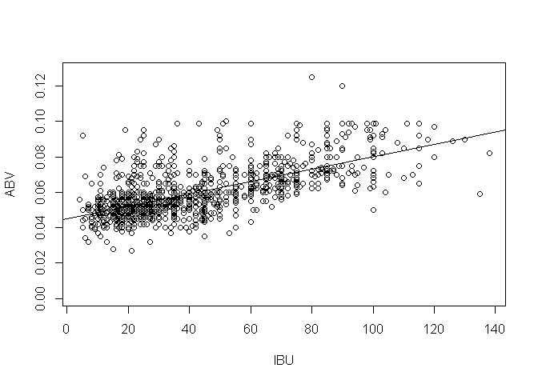
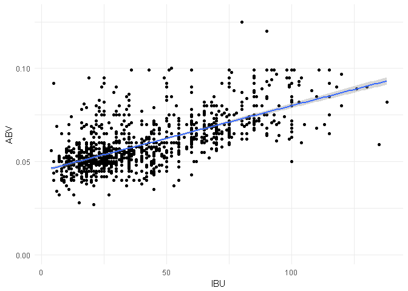

# Craft-Cans Case Study
Arturo Casillas & Kevin Dickens  
October 6, 2017  

# R Markdown Dummy

First

## About the Data
#### Source

- The tables contain a list of 2410 US craft beers and 510 US breweries. 
- The beer data corresponds to beers available in cans
- This data was traced to CraftCans.com. 

#### View the data


```r
## Load Data ##
#getwd()
setwd("C:/Users/acasi/Downloads")
BeersData <- read.csv("Beers.csv")
BreweriesData <- read.csv("Breweries.csv")

str(BeersData)
```

```
## 'data.frame':	2410 obs. of  7 variables:
##  $ Name      : Factor w/ 2305 levels "#001 Golden Amber Lager",..: 1638 577 1705 1842 1819 268 1160 758 1093 486 ...
##  $ Beer_ID   : int  1436 2265 2264 2263 2262 2261 2260 2259 2258 2131 ...
##  $ ABV       : num  0.05 0.066 0.071 0.09 0.075 0.077 0.045 0.065 0.055 0.086 ...
##  $ IBU       : int  NA NA NA NA NA NA NA NA NA NA ...
##  $ Brewery_id: int  409 178 178 178 178 178 178 178 178 178 ...
##  $ Style     : Factor w/ 100 levels "","Abbey Single Ale",..: 19 18 16 12 16 80 18 22 18 12 ...
##  $ Ounces    : num  12 12 12 12 12 12 12 12 12 12 ...
```

```r
str(BreweriesData)
```

```
## 'data.frame':	558 obs. of  4 variables:
##  $ Brew_ID: int  1 2 3 4 5 6 7 8 9 10 ...
##  $ Name   : Factor w/ 551 levels "10 Barrel Brewing Company",..: 355 12 266 319 201 136 227 477 59 491 ...
##  $ City   : Factor w/ 384 levels "Abingdon","Abita Springs",..: 228 200 122 299 300 62 91 48 152 136 ...
##  $ State  : Factor w/ 51 levels " AK"," AL"," AR",..: 24 18 20 5 5 41 6 23 23 23 ...
```

## Munging
#### Basic alterations
- Column names are altered for clarity and to minimize merging issues
- The beers and breweries are linked by a numeric ID, which is used to merge the two tables
  - 'Brew_ID'


```r
## Prepare for merging ##
names(BeersData)
```

```
## [1] "Name"       "Beer_ID"    "ABV"        "IBU"        "Brewery_id"
## [6] "Style"      "Ounces"
```

```r
names(BeersData)[5] = "Brew_ID"
names(BeersData)[1] = "Beer.name"
names(BreweriesData)[2] = "Brewery.name"


## Merge Data ##
AllBeer <- merge(BeersData, BreweriesData, by="Brew_ID")
str(AllBeer)
```

```
## 'data.frame':	2410 obs. of  10 variables:
##  $ Brew_ID     : int  1 1 1 1 1 1 2 2 2 2 ...
##  $ Beer.name   : Factor w/ 2305 levels "#001 Golden Amber Lager",..: 802 1258 2185 1640 1926 1525 458 1218 43 71 ...
##  $ Beer_ID     : int  2692 2691 2690 2689 2688 2687 2686 2685 2684 2683 ...
##  $ ABV         : num  0.045 0.049 0.048 0.06 0.06 0.056 0.08 0.125 0.077 0.042 ...
##  $ IBU         : int  50 26 19 38 25 47 68 80 25 42 ...
##  $ Style       : Factor w/ 100 levels "","Abbey Single Ale",..: 16 77 48 83 22 57 12 46 77 18 ...
##  $ Ounces      : num  16 16 16 16 16 16 16 16 16 16 ...
##  $ Brewery.name: Factor w/ 551 levels "10 Barrel Brewing Company",..: 355 355 355 355 355 355 12 12 12 12 ...
##  $ City        : Factor w/ 384 levels "Abingdon","Abita Springs",..: 228 228 228 228 228 228 200 200 200 200 ...
##  $ State       : Factor w/ 51 levels " AK"," AL"," AR",..: 24 24 24 24 24 24 18 18 18 18 ...
```

#### View the data

-first 6 rows

```r
library(knitr)
#library(kableExtra)
kable(head(AllBeer, 6))
```


 Brew_ID  Beer.name        Beer_ID     ABV   IBU  Style                                  Ounces  Brewery.name        City          State 
--------  --------------  --------  ------  ----  ------------------------------------  -------  ------------------  ------------  ------
       1  Get Together        2692   0.045    50  American IPA                               16  NorthGate Brewing   Minneapolis   MN    
       1  Maggie's Leap       2691   0.049    26  Milk / Sweet Stout                         16  NorthGate Brewing   Minneapolis   MN    
       1  Wall's End          2690   0.048    19  English Brown Ale                          16  NorthGate Brewing   Minneapolis   MN    
       1  Pumpion             2689   0.060    38  Pumpkin Ale                                16  NorthGate Brewing   Minneapolis   MN    
       1  Stronghold          2688   0.060    25  American Porter                            16  NorthGate Brewing   Minneapolis   MN    
       1  Parapet ESB         2687   0.056    47  Extra Special / Strong Bitter (ESB)        16  NorthGate Brewing   Minneapolis   MN    

```r
#%>%
#kable_styling(latex_options = c("striped", "scale_down"))
```

## Munging
#### View the final data

last 6 rows


```r
library(knitr)
kable(tail(AllBeer, 6))
```

        Brew_ID  Beer.name                    Beer_ID     ABV   IBU  Style                      Ounces  Brewery.name                    City            State 
-----  --------  --------------------------  --------  ------  ----  ------------------------  -------  ------------------------------  --------------  ------
2405        556  Pilsner Ukiah                     98   0.055    NA  German Pilsener                12  Ukiah Brewing Company           Ukiah           CA    
2406        557  Heinnieweisse Weissebier          52   0.049    NA  Hefeweizen                     12  Butternuts Beer and Ale         Garrattsville   NY    
2407        557  Snapperhead IPA                   51   0.068    NA  American IPA                   12  Butternuts Beer and Ale         Garrattsville   NY    
2408        557  Moo Thunder Stout                 50   0.049    NA  Milk / Sweet Stout             12  Butternuts Beer and Ale         Garrattsville   NY    
2409        557  Porkslap Pale Ale                 49   0.043    NA  American Pale Ale (APA)        12  Butternuts Beer and Ale         Garrattsville   NY    
2410        558  Urban Wilderness Pale Ale         30   0.049    NA  English Pale Ale               12  Sleeping Lady Brewing Company   Anchorage       AK    


## Data Integrity
#### Missing Vlaues
- Check the missing values number and indicators

```r
## Check for missing values ##
apply(apply(AllBeer, 2, is.na), 2, sum)
```

```
##      Brew_ID    Beer.name      Beer_ID          ABV          IBU 
##            0            0            0           62         1005 
##        Style       Ounces Brewery.name         City        State 
##            0            0            0            0            0
```

```r
t=sapply(AllBeer, function(y) sum(length(which(is.na(y)))))
summary(t)
```

```
##    Min. 1st Qu.  Median    Mean 3rd Qu.    Max. 
##     0.0     0.0     0.0   106.7     0.0  1005.0
```

#### Notes and Observations
- Only ABV and IBU have missing values
  - Almost 50% of IBU values are missing
  -This certainly affect any analysis that hinges on IBU values
- Spot checks on the data suggest that character variables use blanks for missing values
  - This needs to be verified

#### Double Check Missing Vlaues
- Check for blanks instead of NA's

```r
## Double Check ##
## Look at balnk Strings ##
apply(AllBeer, 2, function(y) sum(y == ""))
```

```
##      Brew_ID    Beer.name      Beer_ID          ABV          IBU 
##            0            0            0           NA           NA 
##        Style       Ounces Brewery.name         City        State 
##            5            0            0            0            0
```

```r
##Fancy table
library(pander)
#panderOptions('graph.fontsize', .8)
pander(apply(AllBeer, 2, function(y) sum(y == "")))
```


---------------------------------------------------------------------------
 Brew_ID   Beer.name   Beer_ID   ABV   IBU   Style   Ounces   Brewery.name 
--------- ----------- --------- ----- ----- ------- -------- --------------
    0          0          0      NA    NA      5       0           0       
---------------------------------------------------------------------------

Table: Table continues below

 
--------------
 City   State 
------ -------
  0       0   
--------------
- 'Stye', which represents style of beer, has 5 additional missing values

#### External Data

- From R
  - R contains additional region and division data per state in the package 'Datasets'
  - This data is from a 1977 report from the chamber of commerce

  

```
## 'data.frame':	0 obs. of  12 variables:
##  $ State         : Factor w/ 51 levels " AK"," AL"," AR",..: 
##  $ Brew_ID       : int 
##  $ Beer.name     : Factor w/ 2305 levels "#001 Golden Amber Lager",..: 
##  $ Beer_ID       : int 
##  $ ABV           : num 
##  $ IBU           : int 
##  $ Style         : Factor w/ 100 levels "","Abbey Single Ale",..: 
##  $ Ounces        : num 
##  $ Brewery.name  : Factor w/ 551 levels "10 Barrel Brewing Company",..: 
##  $ City          : Factor w/ 384 levels "Abingdon","Abita Springs",..: 
##  $ state.region  : Factor w/ 4 levels "Northeast","South",..: 
##  $ state.division: Factor w/ 9 levels "New England",..:
```

#### Tail2

-experiment with plotting last 6 rows


 Brew_ID  Beer.name        Beer_ID     ABV   IBU  Style                                  Ounces  Brewery.name        City          State 
--------  --------------  --------  ------  ----  ------------------------------------  -------  ------------------  ------------  ------
       1  Get Together        2692   0.045    50  American IPA                               16  NorthGate Brewing   Minneapolis   MN    
       1  Maggie's Leap       2691   0.049    26  Milk / Sweet Stout                         16  NorthGate Brewing   Minneapolis   MN    
       1  Wall's End          2690   0.048    19  English Brown Ale                          16  NorthGate Brewing   Minneapolis   MN    
       1  Pumpion             2689   0.060    38  Pumpkin Ale                                16  NorthGate Brewing   Minneapolis   MN    
       1  Stronghold          2688   0.060    25  American Porter                            16  NorthGate Brewing   Minneapolis   MN    
       1  Parapet ESB         2687   0.056    47  Extra Special / Strong Bitter (ESB)        16  NorthGate Brewing   Minneapolis   MN    

#Analysis

- The primary variables of interest are ABV, IBU, Style, State, Region and Division

##ABV Summary


```
##    Min. 1st Qu.  Median    Mean 3rd Qu.    Max.    NA's 
## 0.00100 0.05000 0.05600 0.05977 0.06700 0.12800      62
```

##IBU Summary


```
##    Min. 1st Qu.  Median    Mean 3rd Qu.    Max.    NA's 
##    4.00   21.00   35.00   42.71   64.00  138.00    1005
```

##Beer Styles


```
##  Factor w/ 100 levels "","Abbey Single Ale",..: 16 77 48 83 22 57 12 46 77 18 ...
```

## Simple Plot

<!-- -->


## Fancier Plot

<!-- -->

